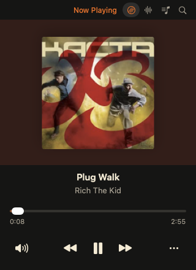
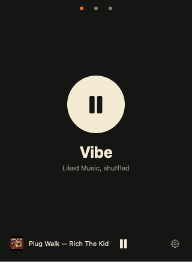
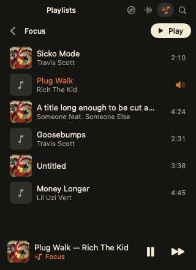
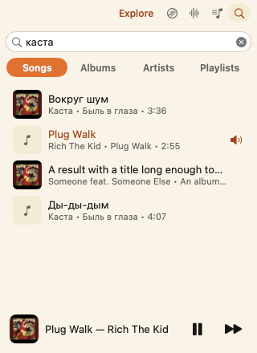

# B-Side

A small, fast YouTube Music player for the Mac. Free and open source.

B-Side is a 320 by 440 window and a record in the menu bar. It plays through
Google's own player in a hidden web view, without YouTube Music's web
interface, so it uses about 175 MB of memory where the full page uses about
500 MB.

<p>
  
  
  
  
</p>

The pictures are rendered by the app itself with sample data.

## What it does

- **Now Playing.** Artwork with a turning record, like, seek, volume, repeat.
  Live lyrics that follow the song; click a line to play from there. Up Next
  shows what plays after this track and lets you jump to it.
- **Vibes.** Tiles that start music in one click: a playlist, Liked Music
  shuffled, a track's radio, or a vibe made from your own words ("rainy
  Sunday, slow jazz, no vocals"). Drag the tiles into your order.
- **Playlists.** Your library, private playlists included. Make, rename and
  delete playlists, add and remove tracks, drag the rows into your order.
- **Explore.** Search songs, albums, artists and playlists; artist and album
  pages.
- **A desktop widget** with the artwork, the names and Play, Pause and Next;
  small and medium. It shows what plays while B-Side runs.
- **Menu bar.** The current track with Previous, Play and Next, every vibe
  and playlist. Closing the window does not stop the music. A setting puts
  the track's name next to the icon.
- **Media keys, AirPods and Control Center** work as with any player. With
  "Open at login" on, the Play key starts B-Side instead of Apple Music.
- **The last track is back** when you open B-Side again, paused where it
  stopped.
- Light and dark, a larger size for reading at a distance, Reduce Motion and
  Reduce Transparency are respected.
- Works without an account for search and radios; your library needs you to
  sign in to Google.

## Requirements

- A Mac with macOS 14 or later. B-Side is developed and tested on macOS 27
  only; the glass surfaces and vibes read on the Mac need macOS 26.
- A YouTube Music account for your library. B-Side does not remove ads:
  without Premium you hear them, and B-Side says when the music comes back.

## Install

**Download.** Get `B-Side-<version>.dmg` from the
[latest release](https://github.com/anhile/b-side/releases/latest), open it
and drag B-Side to Applications.

The build is not signed with an Apple certificate and not notarised yet, so
macOS stops it the first time:

1. Open B-Side. macOS says that Apple could not verify it. Click **Done**.
2. Open System Settings → Privacy & Security, scroll down to "B-Side was
   blocked", and click **Open Anyway**. You do this once.

**Or build it from source.** macOS does not ask about an app built on your
own Mac. You need Xcode and
[XcodeGen](https://github.com/yonaskolb/XcodeGen) (`brew install xcodegen`).

```bash
./scripts/install.sh
```

It builds B-Side, puts it in `/Applications` and opens it.

Either way, run B-Side from `/Applications`, not from the disk image or the
build folder: macOS treats the copy in `/Applications` as the app, and Open
at login and menu bar managers depend on that.

Click **Sign In…** and log in to Google in the window that appears. It closes
by itself when Google sends you back to YouTube Music. Or choose **Continue
as Guest**.

## Shortcuts

| Shortcut | Action |
|---|---|
| Space | Play or pause. With nothing loaded it starts the first vibe |
| Command-Right, Command-Left | Next, previous |
| Command-L | Like the track, or take the like back |
| Command-R | Repeat: off, all, one in turn |
| Shift-Command-V | Play Vibe |
| Command-Up, Command-Down | Volume up, down |
| Option-Command-Down | Mute, unmute |
| Command-1 to Command-4 | Now Playing, Vibes, Playlists, Explore |
| Command-comma | Settings |

A two-finger swipe moves between the pages. Right-click a track anywhere for
its menu: Like, Add to Playlist, Play Next, Start Radio, Go to Artist, Go to
Album, Copy Link.

## Vibes from words

The "+" tile takes a description in any language and turns it into a stream
of songs. By default Apple's on-device model reads the words (macOS 26, with
Apple Intelligence on); nothing leaves the Mac.

Settings, Vibes has an optional switch, off by default: **Read vibes on the
B-Side server**. A larger model then reads the words and knows far more
music. The words are not stored; each Mac gets 10 vibes a month. The server
is in [server/](server/) and anyone can run their own.

## Privacy

B-Side talks to Google (YouTube Music) with your own session, and to nobody
else unless you ask it to: LRCLIB for lyrics YouTube Music has no timings
for, and the B-Side server only if you turn it on. No analytics, no
accounts of its own. The details are in [PRIVACY.md](PRIVACY.md).

## It can break

B-Side depends on how YouTube Music's web player works inside, which is not
documented and changes without notice. A YouTube Music release can break
playback, the library or search until B-Side is updated. It is not
affiliated with Google or YouTube.

Playback goes through Google's own player. B-Side does not extract streams,
decipher signatures or download anything.

## Documentation

| For | Read |
|---|---|
| Something does not work | [docs/TROUBLESHOOTING.md](docs/TROUBLESHOOTING.md) |
| How it is built | [docs/ARCHITECTURE.md](docs/ARCHITECTURE.md) |
| Building, running, testing | [docs/DEVELOPMENT.md](docs/DEVELOPMENT.md) |
| Making a signed, notarised release | [docs/RELEASING.md](docs/RELEASING.md) |
| Contributing | [CONTRIBUTING.md](CONTRIBUTING.md) |
| How it should look and behave | [DESIGN.md](DESIGN.md), [design/SCREENS.md](design/SCREENS.md) |
| What data goes where | [PRIVACY.md](PRIVACY.md) |
| Reporting a vulnerability | [SECURITY.md](SECURITY.md) |
| The vibe server | [server/README.md](server/README.md) |
| Why it is built this way | [docs/research/](docs/research/) |

## License

MIT, see [LICENSE](LICENSE). The server in `server/` is under the same
licence.
